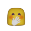
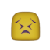

# Emoji Party

Version 0.1.0

<!-- TOC -->

* [Introduction](#introduction)
* [Installing and usage](#installing-and-usage)
* [Emojis List](#emojis-list)
  * [face-smiling](#face-smiling)
  * [face-affection](#face-affection)
  * [face-tongue](#face-tongue)
  * [face-hand](#face-hand)
  * [face-neutral-skeptical](#face-neutral-skeptical)
  * [face-sleepy](#face-sleepy)
  * [face-unwell](#face-unwell)
  * [face-hat](#face-hat)
  * [face-glasses](#face-glasses)
  * [face-concerned](#face-concerned)
  * [face-negative](#face-negative)
  * [others](#others)
* [Contact and Support](#contact-and-support)

<!-- /TOC -->

## Introduction

Emoji Party is a collection with more than 120 3D emojis in FBX format, to be used in a Unity project. It also includes materials compatible Universal Render Pipeline, while it's possible to adopt materials for other render pipelines or other styles (such as different skin colors, etc.). Additionally it includes as well 2D sprites of the same emojis in frontal view.

## Installing and usage

First of all, you must have installed the asset package "Emoji Party" from Unity Asset Store.

Once it's installed in your Unity project, go to folder "EmojiParty" in the project Assets and find folder "Prefabs", pick an emoji of your choice and drag and drop to your scene.

## Emojis List

The list and codes follow the specs as published in [Unicode.org](https://unicode.org/emoji/charts/full-emoji-list.html).

### face-smiling

| Emoji | Number | CLDR Short Name |
|---|---|---|
|     | 001 | grinning face |
|     | 002 | grinning face with big eyes |
|     | 003 | grinning face with smiling eyes |
|     | 004 | beaming face with smiling eyes |
|     | 005 | grinning squinting face |
|     | 006 | grinning face with sweat |
|     | 007 | rolling on the floor laughing |
|     | 008 | face with tears of joy |
|     | 009 | slightly smiling face |
|    | 010 | upside-down face |
|    | 011 | melting face |
|    | 012 | winking face |
|    | 013 | smiling face with smiling eyes |
|    | 014 | smiling face with halo |

### face-affection

| Emoji | Number | CLDR Short Name |
|---|---|---|
|    | 015 | smiling face with hearts |
|    | 016 | smiling face with heart-eyes |
|    | 017 | star-struck |
|    | 018 | face blowing a kiss |
|    | 019 | kissing face |
|    | 020 | smiling face |
|    | 021 | kissing face with closed eyes |
|    | 022 | kissing face with smiling eyes |
|    | 023 | smiling face with tear |
|    | 024 | face savoring food |

### face-tongue

| Emoji | Number | CLDR Short Name |
|---|---|---|
|    | 025 | face with tongue |
|    | 026 | winking face with tongue |
|    | 027 | zany face |
|    | 028 | squinting face with tongue |
|    | 029 | money-mouth face |

### face-hand

| Emoji | Number | CLDR Short Name |
|---|---|---|
|    | 030 | smiling face with open hands |
|    | 031 | face with hand over mouth |
|    | 032 | face with open eyes and hand over mouth |
|    | 033 | face with peeking eye |
|    | 034 | shushing face |
|    | 035 | thinking face |
|    | 036 | saluting face |
|    | 037 | zipper-mouth face |

### face-neutral-skeptical

| Emoji | Number | CLDR Short Name |
|---|---|---|
|    | 038 | face with raised eyebrow |
|    | 039 | neutral face |
|    | 040 | expressionless face |
|    | 041 | face without mouth |
|    | 042 | dotted line face |
|    | 043 | face in clouds |
|    | 044 | smirking face |
|    | 045 | unamused face |
|    | 046 | face with rolling eyes |
|    | 047 | grimacing face |
|    | 048 | face exhaling |
|    | 049 | lying face |
|    | 050 | shaking face |
|    | 051 | relieved face |

### face-sleepy

| Emoji | Number | CLDR Short Name |
|---|---|---|
|    | 052 | pensive face |
|    | 053 | sleepy face |
|    | 054 | drooling face |
|    | 055 | sleeping face |
|    | 056 | face with medical mask |

### face-unwell

| Emoji | Number | CLDR Short Name |
|---|---|---|
|    | 057 | face with thermometer |
|    | 058 | face with head-bandage |
|    | 059 | nauseated face |
|    | 060 | face vomiting |
|    | 061 | sneezing face |
|    | 062 | hot face |
|    | 063 | cold face |
|    | 064 | woozy face |
|    | 065 | face with crossed-out eyes |
|    | 066 | face with spiral eyes |
|    | 067 | exploding head |
|    | 068 | cowboy hat face |

### face-hat

| Emoji | Number | CLDR Short Name |
|---|---|---|
|    | 069 | partying face |
|    | 070 | disguised face |
|    | 071 | smiling face with sunglasses |

### face-glasses

| Emoji | Number | CLDR Short Name |
|---|---|---|
|    | 072 | nerd face |
|    | 073 | face with monocle |
|    | 074 | confused face |

### face-concerned

| Emoji | Number | CLDR Short Name |
|---|---|---|
|    | 075 | face with diagonal mouth |
|    | 076 | worried face |
|    | 077 | slightly frowning face |
|    | 078 | frowning face |
|    | 079 | face with open mouth |
|    | 080 | hushed face |
|    | 081 | astonished face |
|    | 082 | flushed face |
|    | 083 | pleading face |
|    | 084 | face holding back tears |
|    | 085 | frowning face with open mouth |
|    | 086 | anguished face |
|    | 087 | fearful face |
|    | 088 | anxious face with sweat |
|    | 089 | sad but relieved face |
|    | 090 | crying face |
|    | 091 | loudly crying face |
|    | 092 | face screaming in fear |
|    | 093 | confounded face |
|    | 094 | persevering face |
|    | 095 | disappointed face |
|    | 096 | downcast face with sweat |
|    | 097 | weary face |
|    | 098 | tired face |
|    | 099 | yawning face |

### face-negative

| Emoji | Number | CLDR Short Name |
|---|---|---|
|   | 100 | face with steam from nose |
|   | 101 | enraged face |
|   | 102 | angry face |
|   | 103 | face with symbols on mouth |
|   | 104 | smiling face with horns |
|   | 105 | angry face with horns |

### others

| Emoji | Number | CLDR Short Name |
|---|---|---|
|   | 141 | red heart |
|   | 166 | ZZZ |
|   | 168 | raised back of hand |
|  | 168a | raised back of hand - right |
|    | 170  | raised hand |
|  | 170a | raised hand - right |
|    | 189  | backhand index pointing up |
|  | 189a | backhand index pointing up - left |
|    | 191  | backhand index pointing down |
|  | 191a | backhand index pointing down - left |
|    | 192  | index pointing up |
|    | 193  | index pointing at the viewer |
|    | 194  | thumbs up |
|  | 194a | thumbs up - right |
|    | 195  | thumbs down |
|    | 203  | open hands |
|  | 1011 | cloud |

## Contact and Support

* Discord server (chanel **emoji-party**)
  * <https://discord.gg/qhDXgfE4Wd>
* E-mail
  * gameofneutrinos [at] gmail [dot] com
* Unity Asset Store page:
  * search for "Emoji Party"
* Website
  * <http://gameofneutrinos.com>
